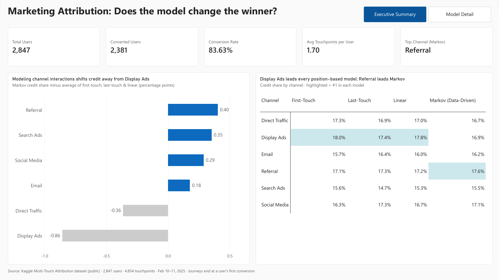
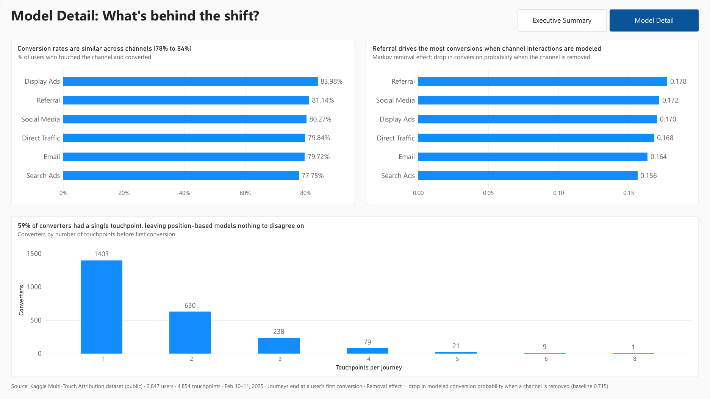

# Multi-Touch Attribution Analysis

## Overview

Many marketing teams use last-touch attribution because it's simple: each conversion goes to the last channel a customer interacted with. The downside is that channels that show up earlier in the journey (like display, social, and email) can end up getting less credit than they deserve.

In this project I compared four attribution models (first-touch, last-touch, linear, and a data-driven Markov chain model) on a public multi-touch dataset. I wanted to see how much the credit for each channel changes depending on which model you use.

**Dataset:** [Multi-Touch Attribution](https://www.kaggle.com/datasets/vivekparasharr/multi-touch-attribution) (Kaggle), 10,000 touchpoint rows with `User ID`, `Timestamp`, `Channel`, `Campaign`, and `Conversion`.

**Tools:** Python (pandas) for cleaning, PostgreSQL for storage and SQL modeling, Power BI for the dashboard.



## Key Findings

- **Display Ads gets the most credit under first-touch, last-touch, and linear attribution.**
- **Referral comes out on top under the Markov model,** which accounts for how channels work together. Display Ads drops to third.
- **The differences are small.** Every channel's share of credit falls between about 15% and 18%, so the dashboard shows the shifts at their actual size.
- **Most journeys are short.** 59% of converters had only one touchpoint. That's why the three position-based models agree so closely: with one touchpoint, first, last, and linear all credit the same channel.

---

## Data Cleaning: What "Conversion" Meant

I started out assuming each `User ID` was one journey ending in one conversion. While exploring the data, I found that `Conversion` is flagged per touchpoint, not per journey. Many users had touchpoints logged *after* their "Yes." For example, User 13186 has 12 touchpoints, and the conversion is the 8th one.

If I had left the data as-is, the models would have given credit to touchpoints that happened after the conversion, which doesn't make sense.

To fix this, I ended each journey at the user's first conversion:

1. Found each converting user's earliest "Yes" timestamp (`first_conversion_time`).
2. Merged that timestamp back onto the full dataset.
3. Kept only the touchpoints at or before it.
4. Left out users who never converted (for Models 1-3 only; the Markov model needs them, see below).

Result: **3,860 touchpoints across 2,381 converting users**, about 1.6 touchpoints per journey.

---

## Database Design

I loaded the cleaned data into a PostgreSQL database (`Attribution_Analytics`) with a small `psycopg2` script that uses parameterized `INSERT` statements. I checked the load with a row count (3,860, matching the CSV) and a spot check of the first rows.

For the dashboard, I organized the database as a **star schema**:

```
             dim_model
                 │
dim_channel ── model_results
     │
     └──────── fact_touchpoints ── dim_campaign
```

| Object | Kind | Purpose |
|---|---|---|
| `fact_touchpoints` | Table | One row per touchpoint, converters and non-converters (4,854 rows / 2,847 users) |
| `model_results` | Table | Final output of all four models, one row per channel and model (24 rows, long format) |
| `dim_channel` | View | Distinct channels (6 rows) |
| `dim_campaign` | View | Campaign key plus a display label (`-` shown as "No Campaign") |
| `dim_model` | Table | Model name, label, type (position-based or data-driven), and sort order |
| `journey_lengths` | View | One row per converter with their journey length, used for the histogram |

A few notes:

- **Why a separate fact table:** the original `journeys` table only has converters, so any conversion rate calculated from it would always be 100%. `fact_touchpoints` uses the same dataset as the Markov model, so the dashboard numbers match the model.
- **Validation:** I ran `LEFT JOIN` orphan checks on every relationship key before building relationships in Power BI. The overall conversion rate is **83.6%** (2,381 of 2,847 users).
- **Missing campaigns:** 31% of touchpoints have no campaign, including all Direct Traffic. That's expected, since direct visits don't come from an ad click.

---

## Models 1-3: Position-Based Attribution (SQL)

I built one view, `numbered_touchpoints`, with window functions:

```sql
ROW_NUMBER() OVER (PARTITION BY user_id ORDER BY touchpoint_time) AS touchpoint_position
```

plus `MAX(touchpoint_position) OVER (PARTITION BY user_id)` to mark the last position. All three models run off this view:

- **First-touch:** credit to position 1
- **Last-touch:** credit to the last position
- **Linear:** credit split evenly (`SUM(1.0 / max_position)`)

| Channel | First-touch | Last-touch | Linear |
|---|---|---|---|
| Display Ads | 428 | 415 | 424.5 |
| Direct Traffic | 411 | 402 | 405.2 |
| Referral | 408 | 412 | 410.0 |
| Social Media | 389 | 412 | 396.8 |
| Email | 374 | 391 | 381.2 |
| Search Ads | 371 | 349 | 363.3 |

Display Ads leads all three, and the rankings barely change. I expected the model choice to matter more here, but with journeys this short, the first and last touchpoint are often the same one.

---

## Model 4: Markov Chain (Python)

A Markov removal-effect model asks: *how many conversions would be lost if this channel disappeared?* To answer that, the model needs journeys that didn't convert too, so I added non-converters back in for this model only:

- Converters: touchpoints up to their first conversion, ending in `"Conversion"`
- Non-converters: full history, ending in `"Null"`

That's 2,847 users total, which matches the number of unique users in the raw data.

**How I built it:**

1. Turned each user's touchpoints into an ordered path, like `[Start, Social Media, Direct Traffic, Email, Conversion]`.
2. Split every path into `(from, to)` pairs: 7,701 transitions in total.
3. Calculated the probability of moving from each channel to every next step.
4. Calculated the baseline conversion probability, then removed each channel one at a time and measured the drop.

**Results:**

| Channel | Removal Effect |
|---|---|
| Referral | 0.1776 |
| Social Media | 0.1719 |
| Display Ads | 0.1702 |
| Direct Traffic | 0.1682 |
| Email | 0.1635 |
| Search Ads | 0.1564 |

Baseline conversion probability: **0.7147**.

**Two bugs I caught along the way.** Both were indentation errors:

- `remove_channel()` returned after processing only the first channel. Testing it directly showed 1 channel returned instead of 6.
- The loop that built the transition probabilities saved only the *first* destination for each channel. I found it because the Display Ads removal effect came back as exactly `0.0`. That seemed too clean, so I checked the `Start` probabilities and found 1 destination where there should have been 6.

**A known limitation.** The recursive function that walks the chain uses a `visited` set to avoid infinite loops. Because of that, any path that returns to a channel it already visited is cut off. To see how much this matters, I ran a diagnostic. **425 users (14.9%)** revisit a channel, and they're spread fairly evenly across channels (62 to 90 per channel). I decided to keep the function as-is. The comparison between channels should still hold, but the baseline is a bit low, which explains part of the gap between 0.7147 and the raw 83.6% conversion rate.

---

## Comparing All Four Models

| Rank | First-touch | Last-touch | Linear | Markov |
|---|---|---|---|---|
| 1 | Display Ads | Display Ads | Display Ads | **Referral** |
| 2 | Direct Traffic | Referral / Social Media (tied) | Referral | Social Media |
| 3 | Referral | (tied above) | Direct Traffic | Display Ads |
| 4 | Social Media | Direct Traffic | Social Media | Direct Traffic |
| 5 | Email | Email | Email | Email |
| 6 | Search Ads | Search Ads | Search Ads | Search Ads |

The three position-based models only look at *where* a touchpoint falls in the journey. The Markov model also looks at how channels lead into each other, and that's where Referral pulls ahead. A team budgeting off position-based attribution alone might put less into Referral than it contributes.

---

## Power BI Dashboard

A two-page report (`Attribution_Dashboard.pbix`, 1920 x 1080), connected to PostgreSQL. An earlier one-chart version is kept in `Analysticss.pbix`.

**Page 1: Executive Summary** (screenshot above)

- KPI cards: Total Users 2,847, Converted Users 2,381, Conversion Rate 83.6%, Avg Touchpoints per User 1.70, Top Channel (Markov) **Referral**
- A diverging bar chart of each channel's **Markov shift**: its Markov credit share minus the average of the three position-based models, in percentage points
- A matrix of credit share by channel and model, with each model's #1 channel highlighted
- A hover tooltip that shows one channel's credit share under all four models

**Page 2: Model Detail**



- Conversion rate by channel (78% to 84%)
- Markov removal effects at their actual scale
- A journey-length histogram of converters (1,403 of 2,381 had a single touchpoint)

**Where the credit moves (Markov vs. position-based average):**

| Channel | Shift (pp) |
|---|---|
| Referral | +0.40 |
| Search Ads | +0.35 |
| Social Media | +0.29 |
| Email | +0.18 |
| Direct Traffic | -0.36 |
| Display Ads | -0.86 |

The shifts add up to zero, since changing the model moves credit between channels without creating any new credit.

**Design choices:**

- **Why a shift chart:** the differences are under one percentage point. A regular bar chart that starts at zero hides them, and a zoomed-in axis exaggerates them. Plotting the difference shows the change at its real size.
- **Credit share %, not raw values:** the SQL models produce counts (350-430) and Markov produces probabilities (0.15-0.18). Converting each to a share of its model's total puts them on one scale.
- **No matrix totals:** a total across models would be dominated by the count-based models, so I turned it off.
- **One population for every KPI:** all cards use the full 2,847 users.
- **Explicit DAX measures only,** stored in a `_Measures` table. I checked each one against pgAdmin or Python before using it in a visual.
- **Star schema model:** 4 one-to-many, single-direction relationships. I removed an auto-detected relationship between `journey_lengths` and `fact_touchpoints` because it could quietly filter out non-converters.
- **No date table:** the data only covers Feb 10-11, 2025.

**DAX measures:** Total Users, Converted Users, Conversion Rate, Avg Touchpoints per User, Credit, Credit Share %, Channel Rank (RANKX), Markov Share, Position Avg Share, Markov Shift (pp), Top Channel (Markov), Converters, Tooltip Title.

---

## Repository Structure

| Path | What it is |
|---|---|
| `explore_data.py` | Exploration of the raw data, including how I found the per-touchpoint conversion issue |
| `clean_journeys.py` | Builds converter journeys (touchpoints up to first conversion) into `journeys_clean.csv` |
| `markov_model.py` | Markov chain removal effects; also exports `all_journeys.csv` |
| `load_to_postgres.py` | Loads `journeys_clean.csv` into the `journeys` table |
| `load_fact_touchpoints.py` | Loads `all_journeys.csv` into `fact_touchpoints` |
| `test_connection.py` | Read-only PostgreSQL connection check |
| `sql/schema.sql` | All tables and views (schema only) |
| `sql/position_models.sql` | First-touch, last-touch, and linear queries |
| `sql/verification_checks.sql` | Row counts, journey-length checks, and orphan checks, with expected results |
| `Attribution_Dashboard.pbix` / `.pdf` | Power BI dashboard and PDF export (`Analysticss.pbix` is the earlier v1) |
| `images/` | Dashboard screenshots |

## How to Reproduce

1. **Download the data** from [Kaggle](https://www.kaggle.com/datasets/vivekparasharr/multi-touch-attribution) and save it in the project folder as `multi_touch_attribution_data.csv`. (Data files aren't stored in this repo.)
2. **Install packages:** `pip install pandas psycopg2`
3. **Build the journeys:** run `python clean_journeys.py`, then `python markov_model.py`.
4. **Create the database** `Attribution_Analytics` and run `sql/schema.sql`.
5. **Set the database password** as an environment variable. On Windows, run `setx PGPASSWORD "your_password"`, then open a new terminal.
6. **Load the data:** run `python load_to_postgres.py` and `python load_fact_touchpoints.py`. Run each **once**, since they insert rows.
7. **Run the models and checks:** `sql/position_models.sql` and `sql/verification_checks.sql`. The `model_results` (24 rows) and `dim_model` (4 rows) tables were filled in from these outputs.
8. **Open** `Attribution_Dashboard.pbix` in Power BI Desktop and point the PostgreSQL connection to your server (`localhost`).

---

## What I Learned

- **Check what the columns actually mean.** The biggest issue in this project was a `Conversion` column that didn't work the way I first assumed. I found it by reading through one user's history row by row.
- **A decision that's right for one model can be wrong for another.** Leaving out non-converters was right for Models 1-3, but the Markov model needed them back.
- **Measure a limitation before deciding what to do about it.** A quick diagnostic on the revisit issue told me how big it was, so I could make an informed call.
- **Double-check results that look too clean.** An exact `0.0` led me to a bug that had been in the code from the start.
